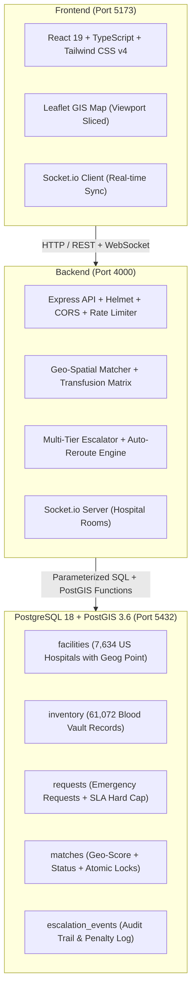

# BloodBanc 🩸
### Nationwide Hospital-to-Hospital Emergency Blood Mutual-Aid Grid

BloodBanc is a real-time, mission-critical B2B mutual-aid platform connecting all **7,634 verified hospitals and blood centers** across all 50 United States and US territories. When an emergency room or surgery trauma team faces an acute shortage of a specific blood group, BloodBanc instantly identifies the closest facilities with compatible inventory, manages automated multi-tier escalation, handles immediate failover if a hospital declines, coordinates ambulance/courier transport, and atomically decrements hospital vault balances.

---

## 🌐 Local Network & Wi-Fi Access

BloodBanc is configured to bind to all network interfaces (`0.0.0.0`) and is accessible from any computer, tablet, or mobile phone connected to the same Wi-Fi / Local Area Network.

| Component | Port | Network Access URL | Localhost URL |
|---|---|---|---|
| **Web Dashboard (Client)** | `5173` | **`http://10.0.0.80:5173`** | `http://localhost:5173` |
| **REST API + WebSocket** | `4000` | **`http://10.0.0.80:4000`** | `http://localhost:4000` |
| **PostgreSQL 18 + PostGIS** | `5432` | `localhost:5432` (Internal) | `localhost:5432` |

> [!TIP]
> **Accessing from your laptop or phone on Wi-Fi**:  
> Open your browser and navigate directly to:  
> **`http://10.0.0.80:5173`**  
> All API requests and real-time WebSockets are seamlessly proxied through port `5173` to the backend on port `4000`.

### Firewall Configuration (UFW)
Inbound TCP traffic on ports `5173` and `4000` is permanently permitted in Ubuntu's Uncomplicated Firewall (UFW):
```bash
sudo /snap/bin/ufw allow 5173/tcp comment "BloodBanc Client"
sudo /snap/bin/ufw allow 4000/tcp comment "BloodBanc API"
```

---

## 🔑 Hospital Accounts & Credentials

Every open hospital in the United States has been provisioned with a secure staff account.

- **Default Password (All Hospitals)**: `password123`
- **Email Format**: `<sanitized-name>.<state>@bloodbanc.demo`

### Quick Demo Accounts
| Hospital Name | Location | Demo Email | Default Password |
|---|---|---|---|
| **St. Mary's Medical Center** | Manhattan, New York (NY) | `stmarys@bloodbanc.demo` | `password123` |
| **Brooklyn General Hospital** | Brooklyn, New York (NY) | `brooklyn@bloodbanc.demo` | `password123` |
| **NYU Langone Health - Cobble Hill** | Brooklyn, New York (NY) | `nyu.langone.health.cobble.hill.ny@bloodbanc.demo` | `password123` |
| **Brooklyn Hospital Center** | Brooklyn, New York (NY) | `brooklyn.hospital.center.downtown.c.ny@bloodbanc.demo` | `password123` |
| **Cedars-Sinai Medical Center** | Los Angeles, California (CA) | `cedars@bloodbanc.demo` | `password123` |
| **NYC Presbyterian Blood Bank** | New York (NY) | `nycpbb@bloodbanc.demo` | `password123` |

---

## 🚀 Core Platform Capabilities

### 1. Complete Nationwide Hospital Dataset
- **7,634 open facilities** ingested from the official US Homeland Infrastructure Foundation-Level Data (HIFLD) dataset.
- Geocoded with exact WGS-84 coordinates (`ST_SetSRID(ST_MakePoint(lng, lat), 4326)::geography`).
- **61,072 initial vault records** (7,634 facilities × 8 blood groups `O-`, `O+`, `A-`, `A+`, `B-`, `B+`, `AB-`, `AB+`) containing **415,341 total units**.

### 2. Location-Factor Spatial Prioritization
When an emergency transfer request is initiated, potential provider facilities are strictly ordered by **PostGIS geodesic physical proximity** (`ST_Distance`).
Multi-tier escalation rings ensure rapid local discovery before statewide expansion:
- **Tier 0 (Local Community)**: $\le 10\text{ km}$ ($<15$ min ETA target)
- **Tier 1 (Metropolitan)**: $\le 50\text{ km}$ ($<30$ min ETA target)
- **Tier 2 (Statewide / Regional)**: $\le 250\text{ km}$ ($<1$ hr SLA)
- **Tier 3 (Interstate)**: $\le 1,000\text{ km}$
- **Tier 4 (Nationwide)**: $\le 5,000\text{ km}$

### 3. Intelligent Blood Transfusion Compatibility
Blood matching adheres strictly to clinical transfusion rules:
- **Exact Match** (Score 0): identical blood group preferred first.
- **Compatible Transfusion** (Score 1): compatible donor blood (e.g. $A^-$ or $O^+$ for an $A^+$ patient).
- **Universal Donor Fallback** (Score 2): $O^-$ is deployed when no exact or direct compatible type is available.
- Completely validates all 27 viable transfusion pathways while blocking all 37 lethal incompatibilities.

### 4. Automatic Rejection Analysis & Dynamic Re-Routing
If a hospital declines or rejects an emergency request (e.g. due to internal surgical surge or local trauma capacity):
1. The declining hospital is immediately excluded from future matches for that request.
2. The spatial engine instantly queries regional inventories for facilities having $\ge$ requested units of compatible blood.
3. The request is **automatically forwarded to the next closest hospital** without requiring manual intervention.
4. WebSocket signals alert the newly matched facility and update the requesting hospital's dashboard in real time with the new hospital's name, city, and distance.
5. Handles multi-facility cascading rejections seamlessly until a provider accepts.

### 5. Atomic Vault Dispensing
When a provider accepts an emergency transfer:
- An atomic PostgreSQL transaction locks the vault row (`SELECT FOR UPDATE`).
- The provider's available units are decremented immediately (`units = GREATEST(units - requested_units, 0)`).
- Request status transitions to `MATCHED` $\rightarrow$ `IN_TRANSIT` $\rightarrow$ `FULFILLED`.
- Race conditions, double-allocations, and phantom inventory are strictly prevented at the database level.

### 6. Interactive Geospatial Map & Emergency Confirmation Line
- **High-Performance Map**: Dynamic viewport slicing renders the 250 closest Leaflet marker pins at 60 FPS without browser DOM lag.
- **Direct Desk Line**: The **📞 Call Hospital Desk** modal instantly displays the verified direct telephone line and physical street address of the partner hospital for verbal courier handoff confirmation.

---

## 🛠️ Architecture & Technology Stack



---

## 📦 Project Structure

```
bloodbanc/
├── client/                     # React + Vite + TypeScript frontend
│   ├── src/
│   │   ├── components/
│   │   │   └── HospitalMap.tsx # Leaflet GIS map with proximity clustering
│   │   ├── App.tsx             # Dashboard, live queue, vault management
│   │   └── main.tsx            # App bootstrap & dynamic socket origin
│   └── vite.config.ts          # Server host: true + /api & /socket.io proxy
├── server/                     # Node.js + Express + TypeScript backend
│   ├── src/
│   │   ├── db/
│   │   │   ├── schema.sql      # Database schema + PostGIS indexes
│   │   │   ├── seed.ts         # Fast batch seeder for 7,634 hospitals
│   │   │   └── us_hospitals.csv# Official HIFLD US Hospitals dataset
│   │   ├── matching/
│   │   │   ├── matcher.ts      # PostGIS candidate search query
│   │   │   └── escalation.ts   # Multi-tier radius expansion logic
│   │   ├── services/
│   │   │   └── requestService.ts# Request lifecycle & auto-reroute engine
│   │   ├── routes/
│   │   │   ├── api.ts          # /facilities, /requests, /inventory
│   │   │   └── auth.ts         # JWT authentication + staff login
│   │   └── index.ts            # Express + Socket.io server listener
├── shared/                     # Shared domain contracts & transfusion matrix
│   └── src/
│       ├── types.ts            # TypeScript interfaces shared across repo
│       └── compatibility.ts    # Transfusion rules & compatibility scoring
└── package.json                # Monorepo workspaces definition
```

---

## ⚡ Development & Operations Guide

### Starting the Servers
From the repository root (`/home/charan/bloodbanc`):

```bash
# Start backend API (Port 4000)
npm run --workspace=server dev

# Start frontend UI (Port 5173, bound to 0.0.0.0)
npm run --workspace=client dev
```

### Compiling & Typechecking
```bash
npm run --workspace=@bloodbanc/shared build
npm run --workspace=server build
npm run --workspace=client build
```

### Re-Seeding the Database
To wipe and re-seed all 7,634 US hospitals and vault records:
```bash
npm run --workspace=server seed
```

### Running Verification Tests
```bash
# Verify census, credentials, geo-proximity, and live blood dispensing:
npx tsx server/src/scripts/verify_dispensing.ts
```

---

## 📄 License
Internal Medical Infrastructure Prototype — Built for emergency hospital-to-hospital mutual-aid operations.
