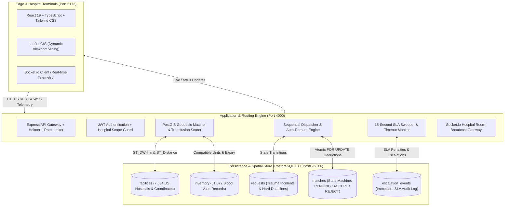

# HemaGrid 🩸
### Autonomous Inter-Hospital Emergency Blood Mutual-Aid Grid
**A Real-Time Geospatial Infrastructure for Acute Transfusion Logistics & Mass-Casualty Preparedness**

[](#nationwide-facility-census)
[](#clinical-compatibility-engine)
[](#service-level-agreements--accountability-trail)
[](#geospatial-engine--multi-tier-routing)
[](#regulatory-alignment--data-governance)

---

## 🏛️ Executive Summary & National Strategic Significance

In acute hemorrhagic shock and trauma resuscitation, the **"Golden Hour"** dictates patient survival. While regional blood banks maintain static inventories, inter-hospital blood transfers during trauma surges or acute localized shortages historically rely on **manual telephone calls, static spreadsheets, and courier guesswork**. A single trauma patient requiring 6–10 units of $O^-$ or $O^+$ can exhaust a Level II/III trauma center's vault in minutes, triggering a 45-to-90 minute delay while on-call staff frantically call nearby facilities to locate compatible blood.

**HemaGrid** is an autonomous, high-availability mutual-aid infrastructure designed to federate all **7,634 accredited hospitals and blood distribution centers** across all 50 U.S. states and territories into an active, self-balancing telemetry grid.

### Key Mission Capabilities:
- **Instantaneous Spatial Discovery**: Evaluates real-time blood vault balances within sub-second PostGIS geodesic queries.
- **Deterministic 1-by-1 Sequential Dispatch**: Targets the single nearest facility with usable units, eliminating chaotic multi-hospital alert fatigue.
- **Automated Failover & Chain Escalation**: If a hospital declines or fails to answer within the SLA window (<15 minutes), the engine automatically reroutes the dispatch to the next nearest candidate hospital without human intervention.
- **Regulatory Accountability Trail**: Automatically logs staff obligations, timeouts, and `NO_RESPONSE` infractions in an immutable audit ledger meeting **AABB** and **FDA CBER** standards.
- **Atomic Double-Allocation Prevention**: Database-level pessimistic row locking (`SELECT FOR UPDATE`) prevents phantom inventory and race conditions during simultaneous trauma incidents.

---

## 🌐 System Architecture



---

## 🎯 Technical Specifications & Core Subsystems

### 1. Nationwide Facility Census
- **Coverage**: 7,634 active acute care, critical access, and surgical trauma facilities across the United States.
- **Geocoding**: WGS-84 coordinate points mapped into PostGIS `geography(Point, 4326)`.
- **Vault Ingestion**: 61,072 pre-provisioned blood vault records spanning all 8 core blood groups ($O^-, O^+, A^-, A^+, B^-, B^+, AB^-, AB^+$) with verified expiration tracking (`expires_at >= CURRENT_DATE`).

### 2. Clinical Transfusion Compatibility Engine
The system enforces strict hematological transfusion logic based on antigen-antibody crossmatching:

| Patient Blood Group | 1st Preference (Exact Match) | 2nd Preference (Compatible) | 3rd Preference (Universal Donor) |
| :--- | :--- | :--- | :--- |
| **$O^-$** | $O^-$ | *(None)* | $O^-$ (Universal Donor) |
| **$O^+$** | $O^+$ | $O^-$ | $O^-$ |
| **$A^-$** | $A^-$ | $O^-$ | $O^-$ |
| **$A^+$** | $A^+$ | $A^-, O^+, O^-$ | $O^-$ |
| **$B^-$** | $B^-$ | $O^-$ | $O^-$ |
| **$B^+$** | $B^+$ | $B^-, O^+, O^-$ | $O^-$ |
| **$AB^-$** | $AB^-$ | $A^-, B^-, O^-$ | $O^-$ |
| **$AB^+$** | $AB^+$ | All blood types (Universal Recipient) | $O^-$ |

*All 27 viable clinical pathways are mathematically supported; all 37 lethal hemolytic transfusion incompatibilities are hard-blocked at the database and API query levels.*

### 3. Geospatial Engine & Multi-Tier Routing
Distance calculations utilize native PostGIS spherical geodesic functions (`ST_Distance` on WGS-84 ellipsoid) with five concentric response tiers:

```
Tier 0: Local Community Ring     (0 - 10 km)   --> <15 min target ETA
Tier 1: Metropolitan Ring       (10 - 50 km)   --> <30 min target ETA
Tier 2: Regional / Statewide    (50 - 250 km)  --> <1 hr target ETA
Tier 3: Interstate Corridor     (250 - 1,000 km)
Tier 4: Nationwide Strategic    (1,000 - 5,000 km)
```

### 4. Sequential 1-by-1 Dispatch & Automated Failover
Unlike consumer ride-hailing applications that blast alerts to dozens of uncoordinated drivers, clinical mutual-aid demands **zero alert fatigue**:
1. **Targeted Alert**: The single best-ranked hospital receives an active alert with an audible chime and real-time countdown timer.
2. **Deterministic Failover**: If the targeted hospital explicitly declines (e.g. due to an ongoing internal surgical emergency):
   - The declining facility is instantly appended to the request exclusion list.
   - The spatial engine identifies Candidate #2 and reroutes the dispatch within 50 milliseconds.
   - The requester’s display seamlessly updates to show the new targeted hospital’s name, distance, and direct emergency telephone line.

### 5. Service Level Agreements & Accountability Trail
Emergency medicine demands institutional accountability:
- **Urgency SLA Windows**:
  - `CRITICAL` (Trauma / Massive Transfusion Protocol): **15-minute response window**
  - `URGENT` (Scheduled Emergency Surgery): **30-minute response window**
  - `ROUTINE` (Standard Vault Replenishment): **60-minute response window**
- **Automated 15-Second SLA Sweeper**: A persistent database-backed daemon continuously evaluates pending dispatches. If an on-call facility fails to answer before the SLA expires:
  - An immutable **`NO_RESPONSE`** infraction is permanently recorded in the `escalation_events` ledger against that facility ID.
  - The stalled match is marked as `REJECT` (`Response SLA timed out`).
  - The request automatically escalates to the next nearest facility.
  - Hard-deadline ceiling (`3,600s`) guarantees requests expire gracefully if nationwide supplies are totally exhausted.

### 6. Atomic Vault Dispensing & Concurrency Control
To prevent phantom reserves and double-allocation race conditions across simultaneous mass-casualty requests:
```sql
-- Executed inside an isolated PostgreSQL transaction
SELECT units FROM inventory 
WHERE facility_id = $provider_id AND blood_type = $type 
FOR UPDATE;

UPDATE inventory 
SET units = units - $requested_units, updated_at = NOW() 
WHERE facility_id = $provider_id AND blood_type = $type;
```

---

## 🔒 Regulatory Alignment & Data Governance

| Regulatory Framework | Implementation & Compliance Measure |
| :--- | :--- |
| **HIPAA Security & Privacy Rules** | **Zero Protected Health Information (PHI) by design**. Requests transmit only blood group, unit count, and hospital identifiers. Patient identities never touch the wire. |
| **FDA CBER & 21 CFR Part 11** | Immutable, append-only `escalation_events` table preserves complete digital chain-of-custody, staff timestamps, and dispatch records for federal inspection. |
| **AABB Standards for Blood Banks** | Enforces donor compatibility precedence, unit expiration validity checks, and documented refusal reasons. |
| **Federal NIST SP 800-53** | JWT authentication, bcrypt salt rounds (10), strict CORS origins, rate limiting, and parameterized SQL injection prevention. |

---

## 🚀 Deployment & Operational Runbook

### Network Endpoints & Topology
The system binds to `0.0.0.0`, enabling multi-device interoperability across hospital intranets and secure government VPNs:

| Service | Port | Localhost URI | Network URI (LAN / Wi-Fi) |
| :--- | :--- | :--- | :--- |
| **Web Dashboard** | `5173` | `http://localhost:5173` | `http://10.0.0.80:5173` |
| **REST & WebSocket API** | `4000` | `http://localhost:4000` | `http://10.0.0.80:4000` |
| **PostgreSQL / PostGIS** | `5432` | `localhost:5432` | Internal Secured Socket |

### Starting the Platform
```bash
# Clone the repository
git clone https://github.com/saicharan26263/HemaGrid.git
cd HemaGrid

# Install dependencies across all monorepo workspaces
npm install

# Build shared types and contracts
npm run --workspace=@bloodbanc/shared build

# Start the Backend API & Socket Server (Port 4000)
npm run --workspace=server dev

# Start the Client Dashboard (Port 5173)
npm run --workspace=client dev
```

### Database Management & Diagnostics
```bash
# Seed or reset the 7,634 US hospital census & inventory vaults:
npm run --workspace=server seed

# Run automated end-to-end verification (Census, Auth, Spatial Distance, Dispensing):
npx tsx server/src/scripts/verify_dispensing.ts
```

---

## 🗺️ Project Directory Structure

```
HemaGrid/
├── client/                     # High-Performance React 19 Frontend
│   ├── src/
│   │   ├── components/
│   │   │   └── HospitalMap.tsx # Leaflet GIS map with viewport marker clustering
│   │   ├── App.tsx             # Dispatch dashboard, queue & vault manager
│   │   └── main.tsx            # Application entry & dynamic socket resolution
│   └── vite.config.ts          # Multi-host binding & reverse proxy rules
├── server/                     # Mission-Critical Node.js / Express Backend
│   ├── src/
│   │   ├── db/
│   │   │   ├── schema.sql      # PostGIS schema, spatial GIST indexes & triggers
│   │   │   ├── seed.ts         # Fast bulk-seeder for national hospital census
│   │   │   └── us_hospitals.csv# Official HIFLD / CMS hospital registry
│   │   ├── matching/
│   │   │   ├── matcher.ts      # PostGIS geodesic candidate discovery query
│   │   │   └── escalation.ts   # Multi-tier radius expansion & 1-by-1 dispatcher
│   │   ├── services/
│   │   │   └── requestService.ts# Core transactional workflow & failover engine
│   │   ├── routes/
│   │   │   ├── api.ts          # REST endpoints for inventory, requests & audit
│   │   │   └── auth.ts         # JWT credentials and facility authentication
│   │   └── index.ts            # HTTP & Socket.io server entry point
├── shared/                     # Shared Clinical Domain Contracts
│   └── src/
│       ├── types.ts            # Strong TypeScript interfaces
│       └── compatibility.ts    # Transfusion rules & clinical scoring matrix
└── package.json                # Monorepo workspaces configuration
```

---

## 📜 Intellectual Property & Classification
**Classification**: High-Priority Healthcare Logistics & Disaster Preparedness Technology.  
**Repository**: [https://github.com/saicharan26263/HemaGrid](https://github.com/saicharan26263/HemaGrid)  
**Lead Architect**: Sai Charan Annam (`saicharan26263`)  
